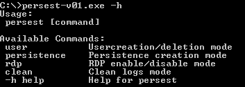
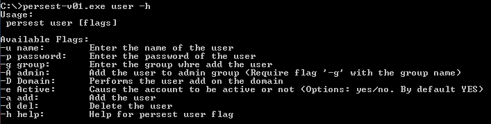
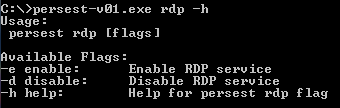
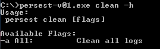
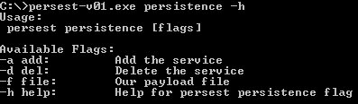

# Persest

Persest is a Windows Post-Exploitation persistence tool. Has 4 built-in features, 3 of them are working and 1 is still in development.

It's not discarded to create more functions in the future and the Persest for **Linux version**.

## Why this project?

I have created this project, to learn to program in C and focus the learning towards the branch, which I like the most, which is cybersecurity. The project is still very green and in the process of development.

The persistence part through executable malware and service creation is still under development.

Several things need to be polished, since I am new to the language.

---

# Usage



## User

The user function is used to create and/or delete users, both locally and in the domain.



```sh
Creation Examples:

persest-v01.exe user -u John -p Password123! -a                                       # Creation of local user
persest-v01.exe user -u John -p Password123! -D <Domain> -a                           # Creation of domain user
persest-v01.exe user -u John -p Password123! -A -g <Admin Group> -a                   # Creation of admin user
persest-v01.exe user -u John -p Password123! -D <Domain> -A -g <Admin Group> -a       # Creation of domain admin user
```

```sh
Deletion Examples:

persest-v01.exe user -u John -d                   # Deletion of local user
persest-v01.exe user -u John -D <Domain> -d       # Deletion of domain user
```

## RDP

The rdp function is used to enable or disable RDP.



```sh
Enable Examples:

persest-v01.exe rdp -a                   # Enable rdp
```

```sh
Disable Examples:

persest-v01.exe rdp -d                   # Disable rdp
```

## Clean

The clean function is used to clear the Event logs.



```sh
Clean Examples:

persest-v01.exe clean -a                   # Clean all Event logs
```

## Persistence  

The persistence function is still in development.


